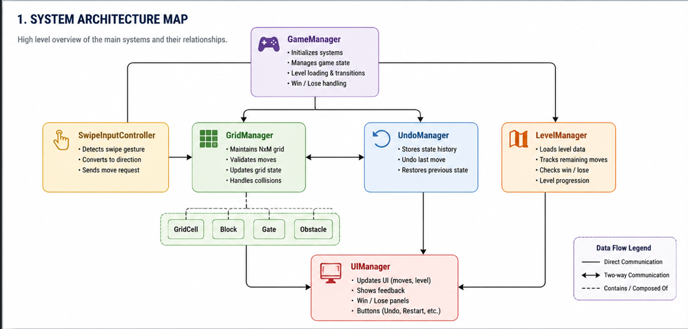
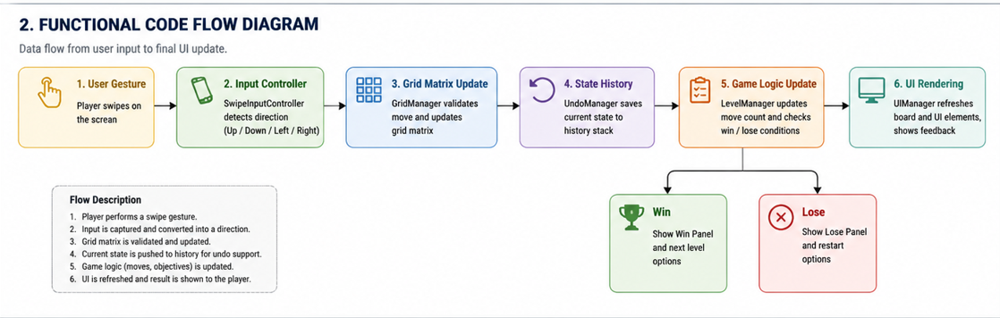
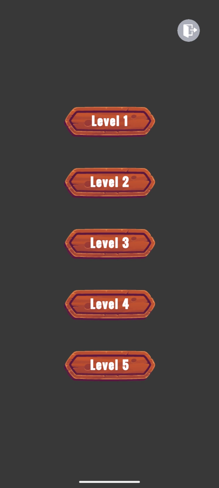
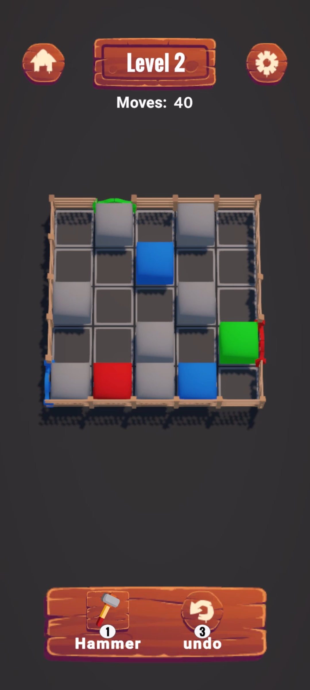
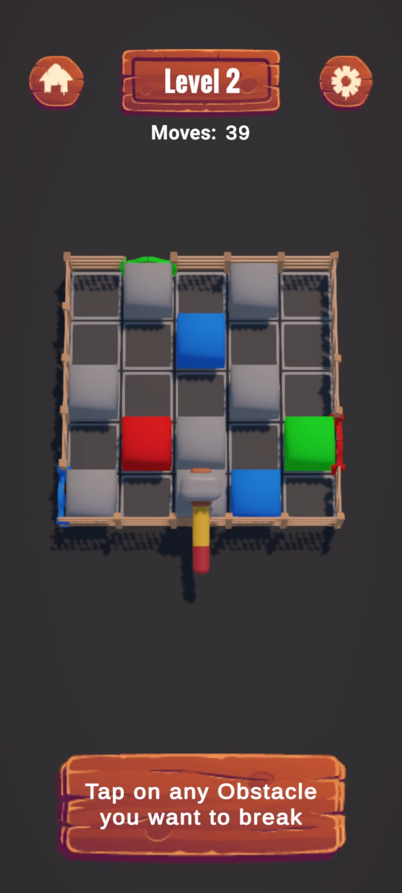
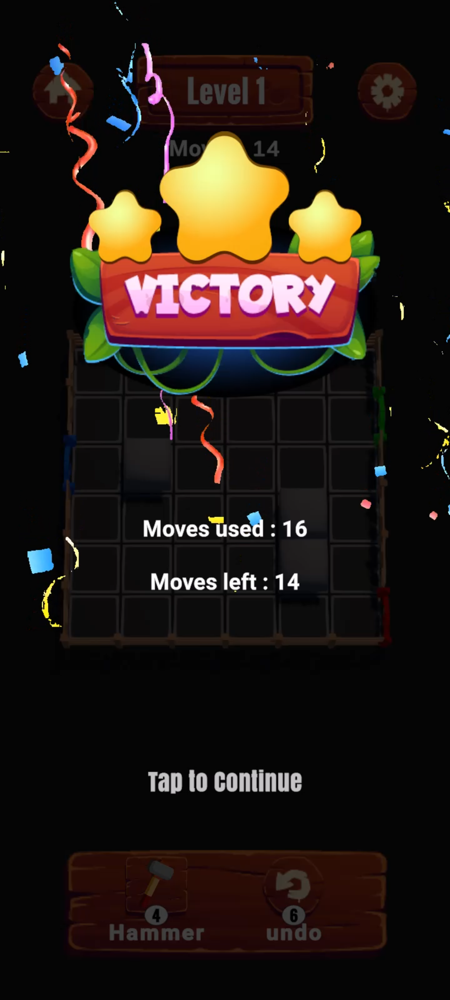
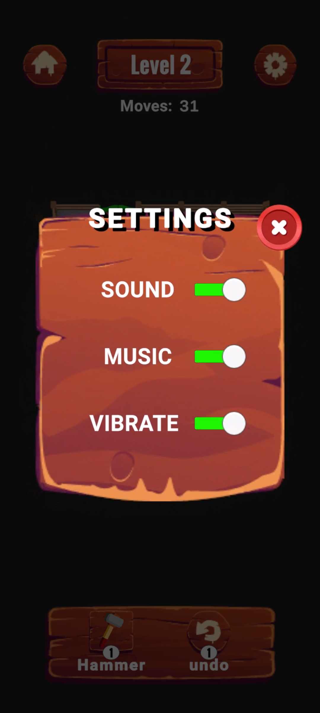
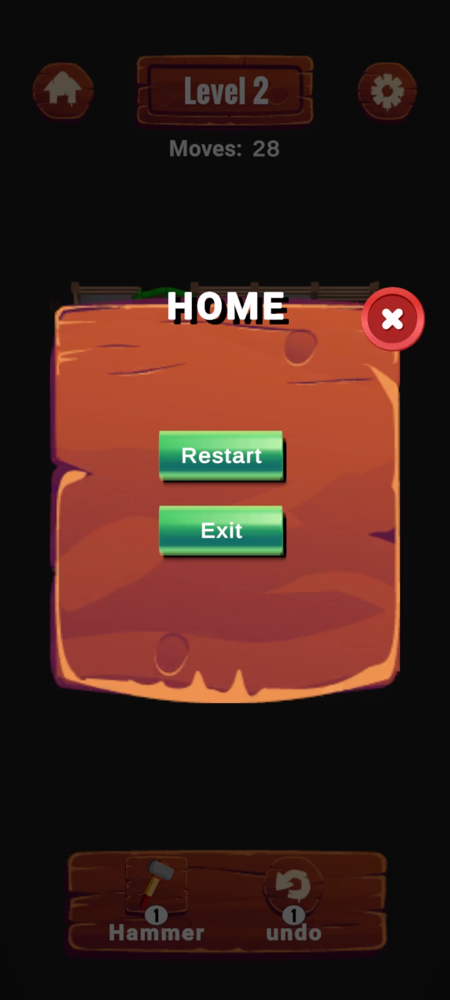

# Color Block Escape

A grid-based mobile puzzle game developed in Unity where players guide colored blocks to their matching exit gates using swipe controls while overcoming obstacles and managing limited moves.

---

## Overview

Color Block Escape is a mobile puzzle game built with Unity and C#. The game focuses on grid-based movement, strategic puzzle solving, undo functionality, and modular architecture.

Players must move colored blocks through the grid and successfully guide them to their corresponding exit gates while avoiding obstacles and managing available moves.

---

## Features

### Core Gameplay

* Grid-based puzzle system
* Swipe controls for mobile devices
* Color-matching exit gates
* Multiple handcrafted levels
* Move counter system
* Win and Lose conditions

### Game Systems

* Undo system with state history tracking
* Level restart functionality
* Level progression system
* Event-driven architecture
* Grid occupancy management

### Power-Ups

#### Hammer Power-Up

* Destroy obstacles instantly
* Integrated with Undo system
* Restores destroyed obstacles when undoing moves

### User Experience

* Smooth movement animations
* Sound effects
* Mobile-optimized controls
* Interactive UI feedback

---

# System Architecture



### Architecture Overview

```text
GameManager
│
├── GridManager
│   ├── GridCell
│   ├── Block
│   └── Gate
│
├── SwipeInputController
│
├── UndoManager
│
├── LevelManager
│
└── UI System
```

### Responsibilities

#### GameManager

* Global game state management
* Level transitions
* Restart handling
* UI page management

#### GridManager

* Grid creation
* Block spawning
* Gate spawning
* Occupancy tracking
* Cell validation

#### SwipeInputController

* Touch input detection
* Swipe direction calculation
* Block selection

#### UndoManager

* State saving
* State restoration
* Undo history management

#### LevelManager

* Move tracking
* Win/Lose validation
* Level completion handling

#### Block

* Movement logic
* Exit detection
* Escape handling

---

# Functional Flow Diagram



### Gameplay Flow

```text
Player Swipe
      ↓
SwipeInputController
      ↓
Block Selection
      ↓
Movement Validation
      ↓
GridManager
      ↓
Grid State Update
      ↓
UndoManager SaveState()
      ↓
Move Counter Update
      ↓
UI Refresh
      ↓
Win/Lose Check
```

---

# Technical Highlights

* Unity Engine
* C#
* ScriptableObjects
* Event-Driven Communication
* Grid-Based Architecture
* Coroutine-Based Animations
* Mobile Input System
* State History Tracking

---

# Project Structure

```text
Assets
├── Scripts
│   ├── Block
│   ├── Grid
│   ├── Managers
│   ├── Input
│   └── UI
│
├── Prefabs
├── ScriptableObjects
├── Scenes
├── Audio
├── Materials
└── Art
```

---

# Controls

## Mobile

* Swipe Up → Move Up
* Swipe Down → Move Down
* Swipe Left → Move Left
* Swipe Right → Move Right

## Editor

* Mouse Input Supported

---

# Screenshots

### Main Menu


### Gameplay


### Hammer Power-Up


### Level Complete


### Settings Page


### Home Page


---

# Gameplay Video

Gameplay Demonstration:

[](https://youtube.com/shorts/pg7J7zzkHeU)
---

# Release

[](https://github.com/negiayush021/Color-Block-Escape/releases/download/v1.0.0/Color.Block.Escape.apk)

Direct download: [Color.Block.Escape.apk](https://github.com/negiayush021/Color-Block-Escape/releases/download/v1.0.0/Color.Block.Escape.apk)

---

# Development Notes

This project was developed with a focus on:

* Clean architecture
* Modular code structure
* Mobile-first gameplay
* Expandable level system
* Maintainable state management

---

# Author

**Ayush Negi**

Game Developer

GitHub:
https://github.com/negiayush021

Repository:
https://github.com/negiayush021/Color-Block-Escape
